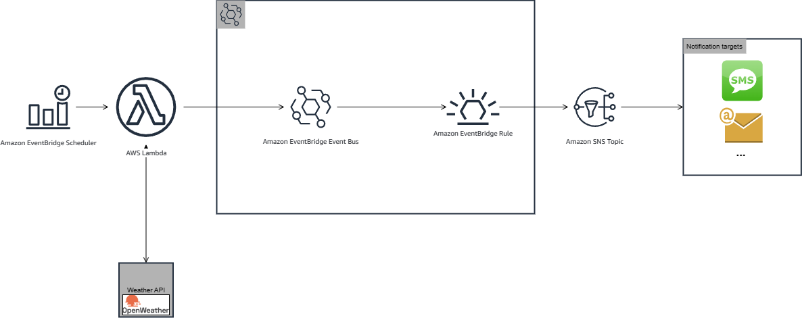
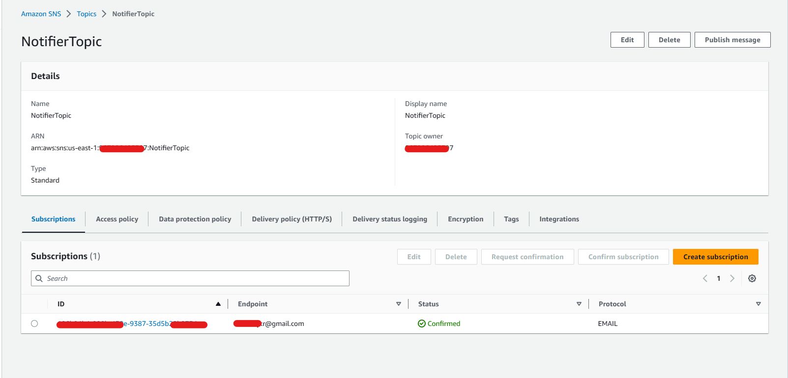

# Serverless Event Driven Architecture for (Weather) Notifications
This project emerged during the time when cyclone [Freddy](https://en.wikipedia.org/wiki/Cyclone_Freddy) was still affecting some regions of Mozambique. Its main function was to provide alerts about the weather conditions of a specific province.

However, this repository presents an improvement of the solution that was previously implemented in a way that all resources are provisioned on the fly, following a serverless architecture.

The diagram below shows the architecture overview


## Built With
* [Serverless Framework](https://www.serverless.com/)

## Prerequisites 
If you wish to get your own version of the utility up and running, ensure the following on your environment:
* A configured AWS profile 
* Serverless CLI 
* An [OpenWeather](https://openweathermap.org/api) API KEY


### Pre configuration

Ensure you replace `<YOUR_API_KEY>` on the `serverless.yml` file with your API own API KEY from OpenWeather.

### Deployment

In order to deploy the utility, you need to run the following command:

```
$ serverless deploy
```

After running deploy, you should see output similar to:

```bash
$ sls deploy
Running "serverless" from node_modules

Deploying gods-eye to stage dev (us-east-1)

✔ Service deployed to stack gods-eye-dev (142s)

functions:                                                                                                                                                                                                                              
  notifier: gods-eye-dev-notifier (13 MB)

```

### Configure notification subscriptions
In order to receive notifications, the subscriptions must be configured and confirmed within the AWS
Console.


### Invocation

After successful deployment, the function will be automatically invoked by the `EventBridge Scheduler` using the configured rate.


Or, you can invoke the deployed function by using the following command:

```bash
serverless invoke --function notifier
```

Which should result in response similar to the following:

```json
[
    {
        "FailedEntryCount": 0,
        "Entries": [
            {
                "EventId": "df2bda9a-2825-fa0f-56fe-8ef488e75ac4"
            }
        ],
        "ResponseMetadata": {
            "RequestId": "d5b13719-1704-489c-a369-db487c738725",
            "HTTPStatusCode": 200,
            "HTTPHeaders": {
                "x-amzn-requestid": "d5b13719-1704-489c-a369-db487c738725",
                "content-type": "application/x-amz-json-1.1",
                "content-length": "85",
                "date": "Sun, 02 Jul 2023 09:54:46 GMT"
            },
            "RetryAttempts": 0
        }
    }
]
```

After the function invocation, a notification should be received to the configured subscriptions, 
the information within the received message should be similar to the one below:
```json
{
   "version":"0",
   "id":"4d852bfb-4828-9f5e-0ff8-22b09c2eb255",
   "detail-type":"weather",
   "source":"com.almeidadealmeida.godseye",
   "account":"***********",
   "time":"2023-07-01T10:42:58Z",
   "region":"us-east-1",
   "resources":[
      
   ],
   "detail":{
      "city":"Inhambane",
      "wind_speed":2.06
   }
}
```